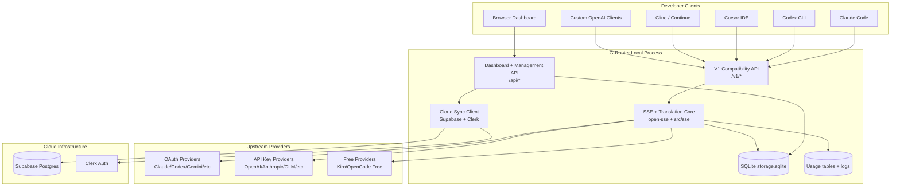
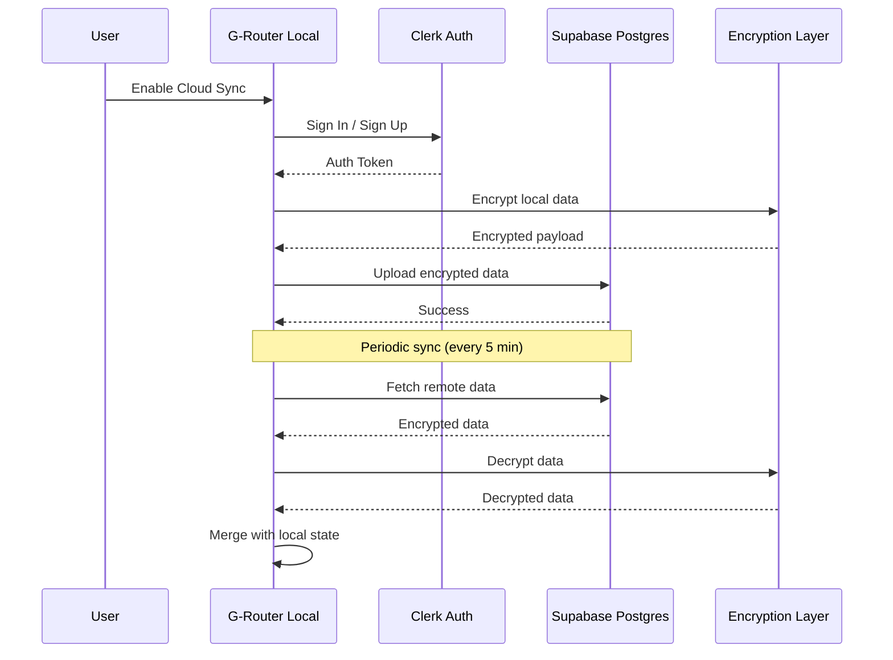
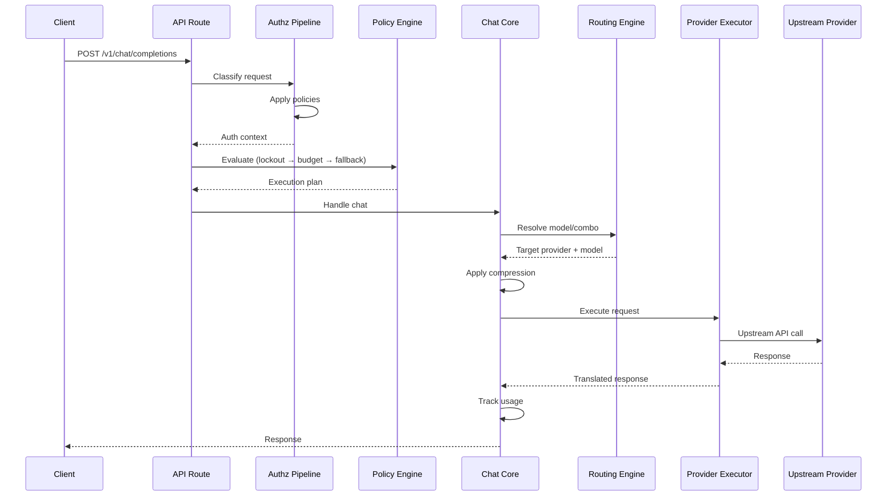

# G-Router (Golden Router) - System Design Document

**Project Code:** G-Router  
**Version:** 1.0  
**Date:** 2026-05-23  
**Status:** Draft

---

## 1. Executive Summary

G-Router is a unified AI gateway that combines the best features from OmniRoute and 9router. Built as a monorepo with full Golden Router branding, it provides developers with a single endpoint to access 177+ AI providers (50+ free), intelligent routing, token compression, and cloud sync capabilities.

**Key Design Decisions:**

- **Base:** Fork OmniRoute (most complete feature set)
- **Architecture:** Monorepo structure with clear module separation
- **Branding:** Full Golden Router identity
- **Cloud Sync:** Supabase (Postgres) + Clerk (Auth)
- **Deployment:** npm global, Docker, Electron desktop, Cloudflare Workers

---

## 2. System Architecture

### 2.1 High-Level Architecture



### 2.2 Component Layers

#### Layer 1: API Surface

- **Compatibility API:** OpenAI-compatible `/v1/*` endpoints
- **Management API:** Dashboard and configuration `/api/*` endpoints
- **Agent Protocols:** MCP server, A2A server

#### Layer 2: Core Processing

- **Routing Engine:** 14 strategies + Auto Combo Engine
- **Translation Layer:** Format conversion (OpenAI ↔ Claude ↔ Gemini)
- **Compression Pipeline:** RTK + Caveman stacked compression
- **Resilience Layer:** Circuit breakers, cooldowns, lockouts

#### Layer 3: Persistence

- **Local DB:** SQLite for providers, combos, settings, usage
- **Cloud Sync:** Supabase for multi-device state sync
- **Auth:** Clerk for user authentication

#### Layer 4: Deployment

- **CLI:** npm global install
- **Desktop:** Electron wrapper
- **Docker:** Containerized deployment
- **Edge:** Cloudflare Workers (optional)

---

## 3. Monorepo Structure

### 3.1 Repository Layout

```
G-Router/
├── src/                      # Next.js 16 application
│   ├── app/                  # App Router (UI + API routes)
│   ├── lib/                  # Core libraries (DB, auth, OAuth, etc.)
│   ├── domain/               # Pure domain logic (policy, fallback, cost)
│   ├── server/               # Server-only modules (authz, CORS)
│   ├── shared/               # Shared types, constants, validation
│   ├── i18n/                 # Internationalization (30+ locales)
│   └── middleware/           # Route middleware
├── open-sse/                 # Streaming engine workspace
│   ├── handlers/            # Request handlers (chat, embeddings, etc.)
│   ├── executors/           # Provider executors (38 providers)
│   ├── translator/          # Format converters
│   ├── services/            # Business logic services
│   └── mcp-server/          # MCP server implementation
├── electron/                 # Desktop wrapper (Electron 41)
├── bin/                      # CLI entry points
├── scripts/                  # Build, check, sync scripts
├── docs/                     # Public documentation
├── tests/                    # Test suites
├── public/                   # Static assets, PWA manifest
├── config/                   # Runtime config samples
├── bmad-agent/              # BMAD agent artifacts
│   └── artifacts/           # Requirements, system design, etc.
├── package.json             # Root manifest
├── tsconfig.json            # TypeScript config
├── next.config.mjs          # Next.js config
├── .env.example             # Environment template
└── README.md                # Project documentation
```

### 3.2 Module Responsibilities

#### `src/app/` - Next.js Application

- **Dashboard UI:** React components with shadcn/ui
- **API Routes:** Both public (v1) and management APIs
- **Auth Pages:** Login, forgot password, callback
- **Static Pages:** Landing, docs, legal, error pages

#### `src/lib/` - Core Libraries

- **Database:** SQLite modules for all data persistence
- **OAuth:** 14 provider OAuth flows
- **Cloud Sync:** Supabase integration for state sync
- **Auth:** Clerk integration for user authentication
- **Skills:** Skill framework execution
- **Memory:** Conversational memory (SQLite + Qdrant)
- **Webhooks:** Outbound webhook dispatcher

#### `src/domain/` - Domain Layer

- **Policy Engine:** Centralized policy evaluation
- **Fallback Policy:** Fallback decision tree
- **Cost Rules:** Cost calculation logic
- **Lockout Policy:** Model/connection lockout
- **Combo Resolver:** Combo resolution logic

#### `open-sse/` - Streaming Engine

- **Handlers:** Request processing pipeline
- **Executors:** Provider-specific HTTP executors
- **Translator:** Format conversion hub
- **Services:** 80+ service modules
- **MCP Server:** 37 tools, 3 transports

#### `electron/` - Desktop Wrapper

- **Main Process:** Electron main process
- **Preload:** IPC bridge
- **Builder:** electron-builder config

---

## 4. 9Router Feature Integration Strategy

### 4.1 Integration Approach

**Strategy:** Enhance OmniRoute's existing features with 9router's unique capabilities

| Feature                | OmniRoute Base         | 9Router Enhancement           | Integration Point                      |
| ---------------------- | ---------------------- | ----------------------------- | -------------------------------------- |
| **Compression**        | RTK + Caveman (15-95%) | RTK filters for tool outputs  | `open-sse/services/compression/`       |
| **Cloud Sync**         | Basic sync             | Enhanced sync with encryption | `src/lib/cloudSync.ts` + Supabase      |
| **Usage Analytics**    | Basic tracking         | Advanced analytics dashboard  | `src/app/dashboard/analytics/`         |
| **Multi-Account**      | Basic support          | Round-robin + priority        | `open-sse/services/accountSelector.ts` |
| **Format Translation** | 9 translators          | Additional formats            | `open-sse/translator/`                 |
| **Request Logging**    | Basic logs             | Debug mode + export           | `src/lib/usage/callLogs.ts`            |

### 4.2 RTK Filter Integration

**Location:** `open-sse/services/compression/rtkFilters.ts`

**Implementation:**

```typescript
// RTK filters from 9router
const RTK_FILTERS = {
  'git-diff': compressGitDiff,
  'git-status': compressGitStatus,
  'grep': compressGrep,
  'find': compressFind,
  'ls': compressLs,
  'tree': compressTree,
  'dedup-log': deduplicateLogs,
  'smart-truncate': smartTruncate,
  'read-numbered': compressNumberedList,
  'search-list': compressSearchList
};

// Auto-detect filter based on tool_result content
function detectRTKFilter(content: string): string | null {
  const first1KB = content.slice(0, 1024);

  if (first1KB.startsWith('diff --git')) return 'git-diff';
  if (first1KB.includes('On branch')) return 'git-status';
  if (first1KB.includes('Binary file')) return 'grep';
  // ... more detection logic
}
```

### 4.3 Cloud Sync Enhancement

**Location:** `src/lib/cloudSync/`

**Components:**

- `supabaseClient.ts` - Supabase client initialization
- `syncManager.ts` - Sync orchestration
- `encryption.ts` - AES-256-GCM encryption
- `conflictResolver.ts` - Merge conflict resolution

**Sync Data:**

- Providers (with encrypted credentials)
- Combos
- Settings
- API keys
- Usage analytics (aggregated)

---

## 5. Cloud Sync Architecture (Supabase + Clerk)

### 5.1 Architecture Overview



### 5.2 Database Schema (Supabase)

#### Tables

**`users`**

```sql
CREATE TABLE users (
  id UUID PRIMARY KEY DEFAULT gen_random_uuid(),
  clerk_user_id VARCHAR(255) UNIQUE NOT NULL,
  email VARCHAR(255),
  created_at TIMESTAMP DEFAULT NOW(),
  updated_at TIMESTAMP DEFAULT NOW()
);
```

**`sync_data`**

```sql
CREATE TABLE sync_data (
  id UUID PRIMARY KEY DEFAULT gen_random_uuid(),
  user_id UUID REFERENCES users(id) ON DELETE CASCADE,
  device_id VARCHAR(255) NOT NULL,
  data_type VARCHAR(50) NOT NULL, -- 'providers', 'combos', 'settings', etc.
  encrypted_data TEXT NOT NULL,
  version INTEGER DEFAULT 1,
  created_at TIMESTAMP DEFAULT NOW(),
  updated_at TIMESTAMP DEFAULT NOW(),
  UNIQUE(user_id, device_id, data_type)
);
```

**`sync_conflicts`**

```sql
CREATE TABLE sync_conflicts (
  id UUID PRIMARY KEY DEFAULT gen_random_uuid(),
  user_id UUID REFERENCES users(id) ON DELETE CASCADE,
  data_type VARCHAR(50) NOT NULL,
  local_data TEXT,
  remote_data TEXT,
  resolved BOOLEAN DEFAULT FALSE,
  created_at TIMESTAMP DEFAULT NOW()
);
```

### 5.3 Clerk Integration

**Auth Flow:**

1. User clicks "Enable Cloud Sync" in dashboard
2. G-Router opens Clerk authentication modal
3. User signs in/signs up via Clerk
4. Clerk returns JWT token
5. G-Router stores token securely (keytar on desktop, encrypted storage)
6. G-Router uses token for Supabase RLS policies

**RLS Policies (Supabase):**

```sql
-- Users can only access their own data
CREATE POLICY "Users can view own sync data"
  ON sync_data FOR SELECT
  USING (auth.uid() = (SELECT id FROM users WHERE clerk_user_id = auth.uid()));

CREATE POLICY "Users can insert own sync data"
  ON sync_data FOR INSERT
  WITH CHECK (auth.uid() = (SELECT id FROM users WHERE clerk_user_id = auth.uid()));

CREATE POLICY "Users can update own sync data"
  ON sync_data FOR UPDATE
  USING (auth.uid() = (SELECT id FROM users WHERE clerk_user_id = auth.uid()));
```

### 5.4 Encryption Strategy

**Algorithm:** AES-256-GCM

**Key Derivation:**

- Derive encryption key from Clerk user ID + device-specific salt
- Salt stored locally (encrypted with device key)
- Key never leaves device

**Encryption Flow:**

```typescript
// Encrypt before upload
const encrypted = await encryptAES256GCM(
  JSON.stringify(data),
  deriveKey(clerkUserId, deviceSalt)
);

// Decrypt after download
const decrypted = await decryptAES256GCM(
  encryptedData,
  deriveKey(clerkUserId, deviceSalt)
);
```

---

## 6. API Architecture

### 6.1 API Surface

#### Public API (OpenAI-Compatible)

```
/v1/chat/completions          # Main chat endpoint
/v1/messages                  # Anthropic-style messages
/v1/responses                # OpenAI Responses API
/v1/models                   # Model listing
/v1/embeddings               # Embedding generation
/v1/images/generations       # Image generation
/v1/audio/speech             # Text-to-speech
/v1/audio/transcriptions     # Speech-to-text
/v1/videos/generations       # Video generation
/v1/music/generations        # Music generation
/v1/search                   # Web search
/v1/moderations              # Content moderation
/v1/rerank                   # Reranking
/v1/ws                       # WebSocket bridge
```

#### Management API

```
/api/providers               # Provider CRUD
/api/combos                  # Combo CRUD
/api/settings                # Settings CRUD
/api/usage                   # Usage analytics
/api/sync/cloud              # Cloud sync control
/api/oauth                   # OAuth flows
/api/keys                    # API key management
/api/health                  # Health checks
/api/resilience              # Resilience controls
/api/compression             # Compression settings
```

### 6.2 Request Flow



### 6.3 Routing System

**14 Routing Strategies:**

1. `auto` - Zero-config smart routing (Auto Combo Engine)
2. `priority` - Sequential fallback
3. `fill-first` - Use quota before next tier
4. `round-robin` - Load balancing
5. `weighted` - Weighted distribution
6. `p2c` - Provider-to-consumer
7. `least-used` - Minimize usage
8. `cost-optimized` - Minimize cost
9. `auto/cheap` - Auto cheapest
10. `context-relay` - Context-aware
11. `context-optimized` - Context optimization
12. `random` - Random selection
13. `strict-random` - Strict random
14. `lkgp` - Last known good provider
15. `reset-aware` - Reset time aware

**Auto Combo Engine:**

- 9-factor scoring (cost, latency, success rate, quota, lockout, breaker state, failures, availability, tag affinity)
- Virtual factory for ephemeral combos
- Mode packs: coding, fast, cheap, smart
- Auto prefixes: `auto/coding`, `auto/cheap`, `auto/fast`, `auto/offline`, `auto/smart`

---

## 7. Compression Pipeline Integration

### 7.1 Stacked Compression

**Pipeline:** RTK → Caveman

**Savings Calculation:**

```
combined = 1 - (1 - RTK) × (1 - Caveman_input)
average = 1 - (1 - 0.80) × (1 - 0.46) = 89.2%
range = 78.4 – 94.6%
```

### 7.2 RTK Filter System

**Filters:**

- `git-diff` - Compress git diff output
- `git-status` - Compress git status
- `grep` - Compress grep results
- `find` - Compress find results
- `ls` - Compress directory listings
- `tree` - Compress tree output
- `dedup-log` - Deduplicate log entries
- `smart-truncate` - Smart truncation
- `read-numbered` - Compress numbered lists
- `search-list` - Compress search results

**Auto-Detection:**

```typescript
function detectAndApplyRTK(content: string): string {
  const filter = detectRTKFilter(content);
  if (!filter) return content;

  try {
    const compressed = RTK_FILTERS[filter](content);
    // Only use if smaller
    return compressed.length < content.length ? compressed : content;
  } catch (error) {
    // Fail-safe: return original on error
    return content;
  }
}
```

### 7.3 Caveman Integration

**Location:** `open-sse/services/compression/caveman.ts`

**Features:**

- General text compression
- Language packs for different languages
- Preservation engine for code blocks, URLs, JSON
- Configurable compression levels

### 7.4 Compression Analytics

**Tracking:**

- Compression ratio per request
- Total tokens saved
- Compression type breakdown
- Provider-specific savings

**Dashboard:** `/dashboard/compression`

---

## 8. Database Schema (Local SQLite)

### 8.1 Core Tables

**`provider_connections`**

```sql
CREATE TABLE provider_connections (
  id TEXT PRIMARY KEY,
  provider TEXT NOT NULL,
  credentials TEXT NOT NULL, -- Encrypted
  status TEXT DEFAULT 'active',
  created_at TIMESTAMP DEFAULT CURRENT_TIMESTAMP,
  updated_at TIMESTAMP DEFAULT CURRENT_TIMESTAMP
);
```

**`combos`**

```sql
CREATE TABLE combos (
  id TEXT PRIMARY KEY,
  name TEXT NOT NULL UNIQUE,
  models TEXT NOT NULL, -- JSON array
  strategy TEXT DEFAULT 'priority',
  created_at TIMESTAMP DEFAULT CURRENT_TIMESTAMP,
  updated_at TIMESTAMP DEFAULT CURRENT_TIMESTAMP
);
```

**`api_keys`**

```sql
CREATE TABLE api_keys (
  id TEXT PRIMARY KEY,
  key_hash TEXT NOT NULL UNIQUE,
  name TEXT,
  scopes TEXT, -- JSON array
  created_at TIMESTAMP DEFAULT CURRENT_TIMESTAMP
);
```

**`settings`**

```sql
CREATE TABLE settings (
  key TEXT PRIMARY KEY,
  value TEXT NOT NULL,
  updated_at TIMESTAMP DEFAULT CURRENT_TIMESTAMP
);
```

### 8.2 Usage Tables

**`usage_history`**

```sql
CREATE TABLE usage_history (
  id INTEGER PRIMARY KEY AUTOINCREMENT,
  timestamp TIMESTAMP DEFAULT CURRENT_TIMESTAMP,
  provider TEXT NOT NULL,
  model TEXT NOT NULL,
  tokens_in INTEGER DEFAULT 0,
  tokens_out INTEGER DEFAULT 0,
  cost REAL DEFAULT 0,
  combo_id TEXT,
  account_id TEXT
);
```

**`call_logs`**

```sql
CREATE TABLE call_logs (
  id INTEGER PRIMARY KEY AUTOINCREMENT,
  timestamp TIMESTAMP DEFAULT CURRENT_TIMESTAMP,
  request_id TEXT NOT NULL,
  provider TEXT NOT NULL,
  model TEXT NOT NULL,
  status_code INTEGER,
  latency_ms INTEGER,
  error_message TEXT
);
```

### 8.3 Compression Tables

**`compression_analytics`**

```sql
CREATE TABLE compression_analytics (
  id INTEGER PRIMARY KEY AUTOINCREMENT,
  timestamp TIMESTAMP DEFAULT CURRENT_TIMESTAMP,
  request_id TEXT NOT NULL,
  compression_type TEXT NOT NULL, -- 'rtk', 'caveman', 'stacked'
  original_tokens INTEGER NOT NULL,
  compressed_tokens INTEGER NOT NULL,
  savings_percent REAL NOT NULL
);
```

---

## 9. Security Architecture

### 9.1 Local Security

**Credential Storage:**

- AES-256-GCM encryption for API keys
- Keytar for secure storage on desktop
- Environment variables for Docker

**Network Security:**

- TLS/HTTPS support
- IP filtering (loopback-only by default)
- Rate limiting
- SSRF guard (block private/localhost ranges)

**Authorization:**

- API key authentication for public APIs
- Session cookie auth for dashboard
- Management auth for sensitive operations

### 9.2 Cloud Security

**Supabase:**

- Row-Level Security (RLS) policies
- Encrypted data at rest
- Encrypted data in transit (TLS)
- No plaintext credentials stored

**Clerk:**

- OAuth 2.0 / OpenID Connect
- JWT token validation
- Multi-factor authentication support
- Session management

### 9.3 Compliance

**Audit Logging:**

- Opt-in compliance audit log
- Provider CRUD events
- SSRF-blocked request logging
- Pagination for large datasets

**Data Privacy:**

- Zero telemetry by default (opt-in)
- Local-first architecture
- No G-Router cloud in request path
- User controls data sync

---

## 10. Deployment Architecture

### 10.1 Deployment Options

#### npm Global Install

```bash
npm install -g golden-router
golden-router
```

- Default: http://localhost:20128
- Data: `~/.golden-router/`

#### Docker

```bash
docker run -p 20128:20128 -v ~/.golden-router:/data golden-router
```

- Multi-stage build
- Volume for persistence
- Redis sidecar (optional)

#### Electron Desktop

```bash
npm run electron:build
```

- Cross-platform (Windows, macOS, Linux)
- Auto-update support
- System tray integration
- Autostart on boot

#### Cloudflare Workers (Optional)

- Edge deployment for global latency
- Read-only API endpoints
- Cache provider catalog
- Rate limiting at edge

### 10.2 Environment Variables

**Required:**

```env
PORT=20128
DATA_DIR=/root/.golden-router
```

**Optional (Cloud Sync):**

```env
NEXT_PUBLIC_CLERK_PUBLISHABLE_KEY=pk_...
CLERK_SECRET_KEY=sk_...
NEXT_PUBLIC_SUPABASE_URL=https://...
SUPABASE_SERVICE_ROLE_KEY=...
```

**Optional (Features):**

```env
ENABLE_CLOUD_SYNC=true
ENABLE_TELEMETRY=false
LOG_LEVEL=info
```

---

## 11. Performance Considerations

### 11.1 Performance Targets

- **Routing Decision:** < 100ms
- **Compression Overhead:** < 50ms
- **Translation Latency:** < 20ms
- **Concurrent Requests:** 100+
- **Uptime:** 99.9% (local)

### 11.2 Optimization Strategies

**Caching:**

- Provider catalog cache
- Model availability cache
- Quota cache (5-minute TTL)
- Read cache for identical requests

**Connection Pooling:**

- HTTP keep-alive
- Connection reuse per provider
- Circuit breaker for failed providers

**Compression:**

- Lazy compression (only when needed)
- Threshold-based triggering
- Parallel compression pipeline

**Database:**

- SQLite WAL journaling
- Prepared statements
- Connection pooling
- Write-behind for usage data

---

## 12. Monitoring & Observability

### 12.1 Health Monitoring

**Endpoints:**

- `/api/health` - Overall health
- `/api/health/providers` - Provider status
- `/api/health/circuit-breakers` - Circuit breaker state
- `/api/health/quota` - Quota status

**Metrics:**

- Request latency (p50, p95, p99)
- Success rate per provider
- Token usage trends
- Cost tracking
- Compression savings

### 12.2 Logging

**Log Levels:**

- ERROR - Critical failures
- WARN - Degraded performance
- INFO - Normal operations
- DEBUG - Detailed debugging

**Log Types:**

- Request logs
- Proxy logs
- Audit logs (compliance)
- Console logs

### 12.3 Error Tracking

**Integration:**

- Sentry for error tracking
- PostHog for analytics (opt-in)
- Local error logs

**Error Codes:**

- Provider-specific errors
- Rate limit errors
- Authentication errors
- Validation errors

---

## 13. Migration Strategy

### 13.1 From OmniRoute

**Steps:**

1. Fork OmniRoute repository
2. Rename to G-Router
3. Update branding (README, package.json, UI)
4. Integrate 9router features
5. Add Supabase + Clerk integration
6. Update documentation
7. Test migration path

**Breaking Changes:**

- Cloud sync endpoint changes (new Supabase backend)
- Additional environment variables
- New compression filters (RTK)

### 13.2 From 9Router

**Steps:**

1. Extract RTK filter system
2. Extract cloud sync logic
3. Extract usage analytics
4. Integrate into G-Router
5. Update data models
6. Test compatibility

**Migration Path:**

- Export 9router configuration
- Import into G-Router
- Re-authenticate providers
- Validate functionality

---

## 14. Development Workflow

### 14.1 Local Development

```bash
# Install dependencies
pnpm install

# Start development server
pnpm dev

# Run tests
pnpm test

# Build for production
pnpm build

# Run linter
pnpm lint
```

### 14.2 CI/CD Pipeline

**GitHub Actions:**

- On push: Run tests, lint, typecheck
- On PR: Run full test suite, E2E tests
- On release: Build, package, publish to npm

**Checks:**

- Unit tests (Node native test runner)
- Integration tests
- E2E tests (Playwright)
- Protocol E2E tests
- Security audit
- Dependency audit

### 14.3 Release Process

1. Update version in package.json
2. Generate changelog
3. Run full test suite
4. Build artifacts
5. Create GitHub release
6. Publish to npm
7. Update documentation

---

## 15. Future Enhancements

### 15.1 Short-term (MVP + 1)

- Enhanced RTK filters
- Advanced usage analytics
- Cloud sync conflict resolution UI
- Mobile PWA improvements

### 15.2 Medium-term (MVP + 2)

- Skill marketplace
- Custom compression pipelines
- Provider health scoring
- Cost optimization recommendations

### 15.3 Long-term (MVP + 3)

- Multi-tenant cloud deployment
- Enterprise features (SSO, audit logs)
- AI-powered combo optimization
- Global edge network

---

## 16. Risk Mitigation

### 16.1 Technical Risks

**Risk:** Provider API changes
**Mitigation:** Versioned executors, adapter pattern, regular testing

**Risk:** Cloud sync conflicts
**Mitigation:** Conflict resolution UI, manual merge, versioning

**Risk:** Performance degradation
**Mitigation:** Monitoring, caching, circuit breakers

### 16.2 Security Risks

**Risk:** Credential exposure
**Mitigation:** Encryption at rest, secure storage, audit logging

**Risk:** SSRF attacks
**Mitigation:** Outbound URL guard, private IP blocking

**Risk:** Rate limiting abuse
**Mitigation:** Per-account rate limits, IP filtering

### 16.3 Operational Risks

**Risk:** Database corruption
**Mitigation:** WAL journaling, backups, migration testing

**Risk:** Dependency vulnerabilities
**Mitigation:** Regular audits, automated updates, SBOM

**Risk:** Deployment failures
**Mitigation:** Staged rollouts, rollback procedures, monitoring

---

## 17. Success Metrics

### 17.1 Adoption Metrics

- Number of active users
- Number of providers connected per user
- Daily active usage
- Cloud sync adoption rate

### 17.2 Performance Metrics

- Average token savings per user
- Uptime percentage
- Routing decision latency
- Compression efficiency

### 17.3 Cost Metrics

- Total tokens saved
- Total cost saved for users
- Free provider usage percentage
- Cloud sync costs

### 17.4 Quality Metrics

- Successful request rate
- Fallback trigger rate
- Provider failure rate
- Recovery time

---

**Document Status:** Draft - Ready for PM Phase  
**Prepared By:** BMAD Architect  
**Reviewed By:** Pending
